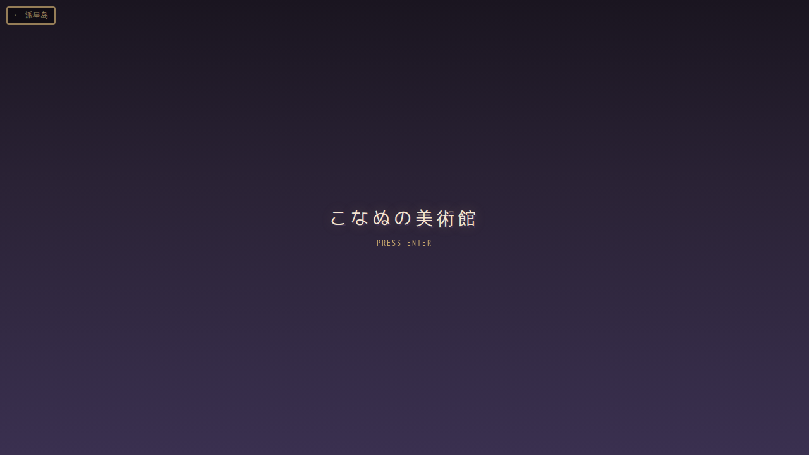
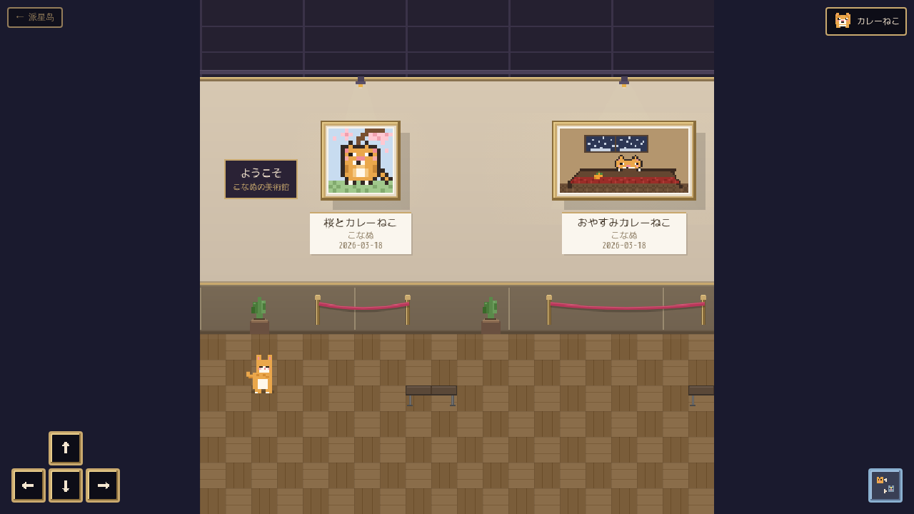

# こなぬの美術館 🍛

**Author:** こなぬ  
**Version:** v1.0 (2026-03-20)

ピクセルアート風の横スクロール美術館ゲーム。カレーねこ（またはほしねこ）を操作して、こなぬの作品を鑑賞できます。




---

## 特徴

- 🐱 **2キャラクター切り替え** — カレーねこ 🍛 & ほしねこ ⭐（Q キーまたはボタンで切替）
- 🖼️ **作品展示** — ピクセルアートが額装されて壁に飾られ、近づくとタイトル・説明が表示される
- 🎮 **PC & モバイル対応** — キーボード操作 + タッチ D-pad
- 🏛️ **美術館空間** — 木の床、スポットライト、ベルベットロープ、ベンチ、観葉植物、窓
- 📍 **ミニマップ** — 右下に現在位置を表示

## 展示作品（v1.0 時点）

| # | タイトル | 日付 |
|---|---------|------|
| 1 | 桜とカレーねこ | 2026-03-18 |
| 2 | おやすみカレーねこ | 2026-03-18 |
| 3 | すきなもの | 2026-03-19 |
| 4 | あめのひ の ピクニック | 2026-03-20 |

## 操作方法

| アクション | PC | モバイル |
|-----------|-----|---------|
| 移動 | ← → ↑ ↓ / W A S D | D-pad ボタン |
| 作品を鑑賞 | E / Enter / Space | 👁 ボタン |
| キャラ切替 | Q | 🔄 ボタン |

## 技術

- **フロントエンド:** Vanilla JS + Canvas 2D（全描画をコードで生成、外部画像は作品のみ）
- **バックエンド:** Flask（静的配信）
- **レスポンシブ:** ビューポート自動フィット
- **ピクセルレンダリング:** `image-rendering: pixelated` で鮮明表示

## ポート

`18806`

## 起動

```bash
systemctl --user start pixel-gallery
```

## 新しい作品を追加する

1. ピクセルアート画像を `artworks/` に置く
2. `index.html` の `const artworks = [...]` 配列に新しいエントリを追加
3. `wallX`（タイル位置）を調整して作品の配置を決める

## ファイル構成

```
pixel-gallery/
├── app.py              # Flask サーバー
├── index.html          # ゲーム本体（HTML/CSS/JS all-in-one）
├── artworks/           # ピクセルアート作品
│   ├── sakura_curry_cat.png
│   ├── kotatsu_curry_cat.png
│   ├── suki_na_mono.png
│   └── rainy_picnic.png
├── screenshot.png      # タイトル画面
├── screenshot-gallery.png  # ゲーム内スクリーンショット
└── static/             # （将来用）
```

## 更新日志

- **v1.0** (2026-03-20) — 安定版リリース 🎉
  - 2キャラクター（カレーねこ / ほしねこ）切り替え
  - 4作品展示（桜、おやすみ、すきなもの、あめのひピクニック）
  - タイトル画面
  - モーダルで作品詳細表示
  - ミニマップ
  - モバイルタッチ操作
  - ビューポート自動フィット
- **v0.1** (2026-03-19) — 初版：横スクロール美術館、3作品展示、カレーねこプレイヤー
